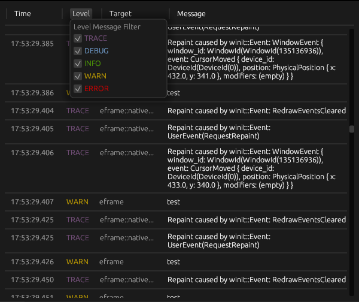

# egui_tracing

> ⚠️ **Note**: This library is under active development. Breaking changes may occur in future releases.

`egui_tracing` is a Rust library that integrates tracing capabilities with the [egui](https://github.com/emilk/egui) immediate mode graphical user interface library. 



## Installation

Add `egui_tracing` to your `Cargo.toml` dependencies:

```toml
[dependencies]
egui_tracing = "0.1"
```

## Examples

To run the example application, use the following command

```sh
cargo run --example eframe
```

## Contributing
Contributions to `egui_tracing` are welcome! Please open an issue or submit a pull request on the GitHub repository.

## License
`egui_tracing` is released under the [Unlicense](LICENSE.md). This means the code is in the public domain, and you can use, modify, and distribute it without any restrictions. For more information, please see the [Unlicense website](https://unlicense.org/).