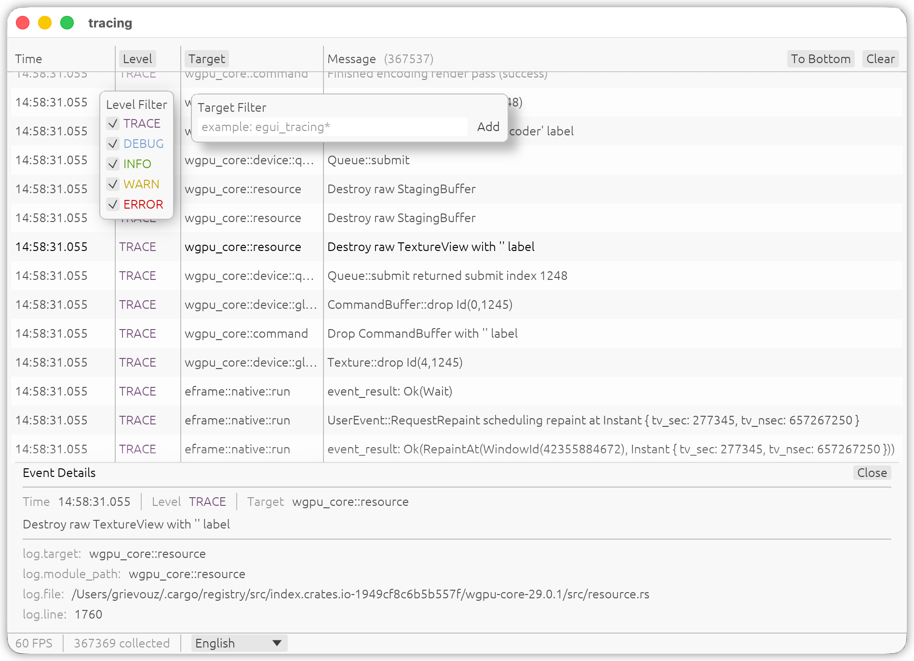

# egui_tracing

[](https://crates.io/crates/egui_tracing)
[](https://docs.rs/egui_tracing)
[](https://github.com/grievouz/egui_tracing/blob/main/LICENSE)


`egui_tracing` is a Rust library that integrates tracing and logging capabilities with the [egui](https://github.com/emilk/egui) immediate mode graphical user interface library. It supports both the [tracing](https://crates.io/crates/tracing) and [log](https://crates.io/crates/log) crates for efficient and flexible event collection and visualization.

[Click to view the web demo](https://grievouz.github.io/egui_tracing/)

## Installation

Add `egui_tracing` to your `Cargo.toml` dependencies:

```toml
[dependencies]
egui_tracing = "0.2.6"
```

## Usage

Set up the collector once at startup and register it as a `tracing` layer:

```rust
let collector = egui_tracing::EventCollector::default();
tracing_subscriber::registry().with(collector.clone()).init();
```

Then render the log view anywhere inside your egui UI:

```rust
ui.add(egui_tracing::Logs::new(collector.clone()));
```

To localize the UI, pass a `Labels` value (built-in: `english`, `portuguese`):

```rust
ui.add(
    egui_tracing::Logs::new(collector.clone())
        .with_labels(egui_tracing::Labels::portuguese()),
);
```

## Example



To run the example application, use the following command:

```sh
cargo run --bin example-eframe
```

## Contributing

Contributions to `egui_tracing` are welcome! Please open an issue or submit a pull request on the GitHub repository.

## License

`egui_tracing` is released under the [Unlicense](LICENSE.md). This means the code is in the public domain, and you can use, modify, and distribute it without any restrictions. For more information, please see the [Unlicense website](https://unlicense.org/).
